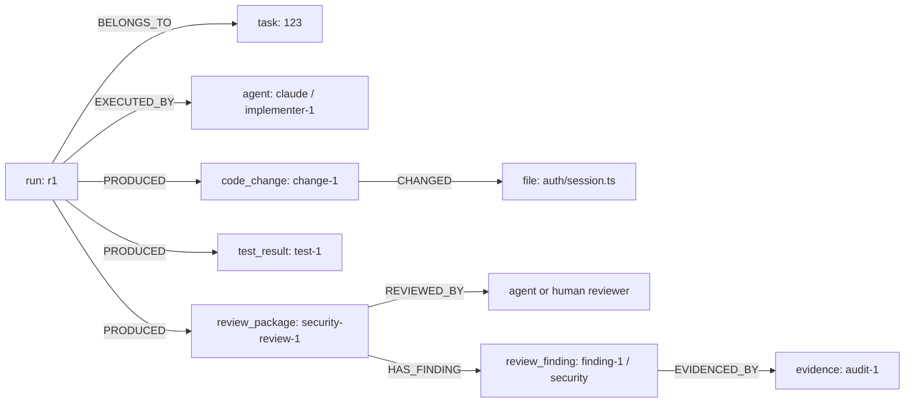

# AI Development Activity Graph v1

Activity Graph is the provider-neutral intermediate model between DevelopmentEvent v1 and DevCrew project intelligence (#70, parent #47). It describes development entities and their relationships. Events and referenced evidence remain the source of truth; the graph is a reconstructable projection, not event storage, UI state or transport.

## Architecture

`DevelopmentEvent → projectDevelopmentEventToGraphUpdates → applyActivityGraphUpdate → ActivityGraph`

The shared implementation lives in `src/shared/activity-graph/`. Projection and reduction are pure, synchronous and independent of Electron, provider runtimes, networking and persistence. An update carries a project ID, node upserts and edge upserts. Consumers can apply one event without rebuilding the graph. Invalid or unsupported event input returns no update using the existing DevelopmentEvent validator.

## Vocabulary

Nodes: `project`, `human`, `agent`, `task`, `run`, `workspace`, `code_change`, `file`, `module`, `test_result`, `review_finding`, `review_package`, `pull_request`, `evidence`.

Workspace and module are typed extension points. Current events have no trustworthy workspace/module identity, so the projection does not fabricate them from source strings, paths or arbitrary metadata. A run uses the existing `sessionId`; there is no competing run identifier.

Edges are explicit and directional:

| Relationship   | Meaning                                                      |
| -------------- | ------------------------------------------------------------ |
| `BELONGS_TO`   | Run belongs to a known task; entity belongs to project       |
| `EXECUTED_BY`  | Run executed by the agent identified in lifecycle payload    |
| `PRODUCED`     | Known task/run produced a change, test, PR or review package |
| `CHANGED`      | Code change affected a normalized file                       |
| `REVIEWED_BY`  | Completed review package reviewed by the stated human/agent  |
| `HAS_FINDING`  | Review package contains a normalized review finding          |
| `EVIDENCED_BY` | Node supported by an event or stable evidence reference      |
| `OCCURRED_IN`  | Reserved for explicit workspace context                      |
| `ASSIGNED_TO`  | Reserved for explicit assignment metadata                    |
| `DEPENDS_ON`   | Reserved for explicit dependency metadata                    |
| `IMPACTS`      | Reserved for impact assertions with evidence in #52          |
| `RESULTED_IN`  | Reserved for future outcome links                            |

An observer/requester is not an assignee. `ASSIGNED_TO`, `DEPENDS_ON`, `IMPACTS` and `RESULTED_IN` require explicit new source semantics; shared-file queries do not assert a dependency or causal impact. Future `attention_item`, `handoff`, `policy_decision` and `outcome` nodes can reuse the same identity construction without implementing their behavior here.

## Identity and isolation

All node identities include type, project and escaped stable identity components. Labels, provider display names and timestamps do not determine identity. Escaping each component prevents delimiter collisions. Tasks use task IDs; runs use session IDs; actors use actor/agent IDs and provider where applicable; commits use SHA; file changes and test results use event ID because two distinct observations may be legitimate; PRs use provider and pullRequestId. Event schema does not contain repository identity, so producers must keep PR IDs unique per project/provider (use qualified IDs for multi-repository projects).

Humans and agents have distinct types even if their IDs collide. Providers are arbitrary strings; no logic assumes Claude implements or Codex reviews. A missing provider does not identify a known provider.

Review package identity includes provider, the existing Review Queue subject key and review ID. Findings additionally include finding ID. `NormalizedReviewResult.subjectId` is the full subject key, never the bare PR/task number. An event with no trustworthy subject uses an explicit `unresolved` component; later context does not silently merge it with a different identity. Reproject when upstream data gains authoritative correlation.

Edge identity is the deterministic tuple `(projectId, relationship, from, to)`. Repeated observations union their evidence rather than duplicate the logical edge. Event-specific code-change/test identities distinguish repeat operations. Each relationship can carry source evidence IDs without copying source payloads.

An update is scoped to exactly one project. The reducer rejects identities outside that scope and edges with missing or cross-project endpoints. Project A can never overwrite project B even when task/session/actor IDs, provider review IDs or file paths collide. The same rules apply to folder workspaces, native, WSL and SSH events: identity normalization depends on source data, not the client OS. Loss of remote contact does not alter run state.

## Event mappings

| Event                                              | Projection                                                                                                                             |
| -------------------------------------------------- | -------------------------------------------------------------------------------------------------------------------------------------- |
| `task.started`, `task.completed`                   | Task lifecycle status when taskId exists                                                                                               |
| `agent.started`, `agent.completed`, `agent.failed` | Payload agent identity; known session run status and EXECUTED_BY; run BELONGS_TO task only when taskId exists                          |
| `file.changed`                                     | Event-scoped code_change, normalized file, CHANGED; known task/run PRODUCED change                                                     |
| `commit.created`                                   | SHA-scoped code_change; known task/run PRODUCED change                                                                                 |
| `pull_request.created`                             | Provider/PR identity; known task/run PRODUCED PR                                                                                       |
| `review.requested`, `review.completed`             | Provider/review identity and lifecycle; known task/run PRODUCED package; explicit PR subject reference; REVIEWED_BY only on completion |
| `test.completed`                                   | Event-scoped result with typed status/counts; known task/run PRODUCED result                                                           |

Common context creates minimal task/run nodes when their IDs are known, preserves run-to-task relationships and records project membership. System actors remain provenance in referenced events; they are not recast as humans or agents. Every supported event supplies a stable event evidence reference. There is no guessing of relationships from prompts, terminal history or file contents.

Existing `NormalizedReviewResult` / `NormalizedReviewFinding` supply review verdict, finding category/severity and evidence references through a separate typed adapter. Findings are not parsed from unconstrained event metadata. Review subject identities follow the Review Queue contract, and disagreement retains its existing signal IDs and evidence semantics rather than introducing a second finding/severity model. Review Queue, Project Pulse and Disagreement Signal remain unchanged.

## Replay and ordering

IDs are deterministic and upserts merge by identity. Evidence references are sorted and deduplicated. Metadata observations use event time with a stable source-ID tie-break, preventing late older events from rolling status backward. Referenced identities create minimal nodes immediately; no important relationship waits for a start event. A later lifecycle event enriches the node without erasing observed fields. Arrays are sorted by ID, so replay is stable and arrival-order independent for valid immutable source events.

Event IDs must identify immutable observations. Correcting an event requires a new event ID. Conflicting payloads under the same event ID violate the source contract.

## Content and redaction boundary

The projection constructs metadata explicitly from typed fields. It does not spread event payloads or `metadata` into graph nodes. It excludes raw credentials, environment variables, prompts, conversations, terminal transcripts, full source files, error output, review summaries and unbounded command output. Evidence is a stable reference, not embedded content. Identity fields and evidence references must themselves be safe identifiers; this is not a secret-detection engine. Producers own redaction before assigning identities.

No arbitrary metadata key is interpreted as a workspace, module, finding, assignment or dependency. File paths are project-relative normalized paths; traversal outside the project and absolute paths must not become file nodes. File contents and commit messages are not stored.

## Example and queries

A task `123` has session `r1`; its agent lifecycle names provider `claude` and agent `implementer-1`. A `file.changed` event `change-1` identifies `auth/session.ts`; `test.completed` event `test-1` reports passed tests. Review package `security-review-1` uses the existing normalized result with a security finding `finding-1` and evidence reference `audit-1`.



Small helpers include node lookup, typed filtering, incoming/outgoing edges and task/run context slices. Context slices traverse artifacts and evidence outward; they do not follow shared files/actors backward into unrelated tasks.

Slices copy and scope node/edge evidence references to the included evidence. Shared file, actor and commit metadata/timestamps still describe the global project entity; a slice is a query result, not a replacement persisted graph. Calling a query never changes the source graph.

```ts
const task = getTaskGraph(graph, projectId, taskId)
const runs = getNodesByType(task, 'run')
const activeTasks = getNodesByType(graph, 'task', projectId).filter(
  (node) => node.metadata.status === 'started'
)
const currentRun = runs.toSorted(
  (a, b) => (b.updatedAt ?? '').localeCompare(a.updatedAt ?? '') || a.id.localeCompare(b.id)
)[0] // Consumer policy: latest observation; overlapping runs remain visible.
const files = getNodesByType(task, 'file')
const tests = getNodesByType(getRunGraph(graph, projectId, sessionId), 'test_result')
const prs = getNodesByType(task, 'pull_request')

const packages = getNodesByType(task, 'review_package')
const awaitingReview = packages.filter((p) => p.metadata.status === 'requested')
const findings = packages.flatMap((p) => getOutgoingEdges(task, p.id, 'HAS_FINDING'))
const reviewers = packages.flatMap((p) => getOutgoingEdges(task, p.id, 'REVIEWED_BY'))
const evidence = findings.flatMap((f) => getOutgoingEdges(task, f.to, 'EVIDENCED_BY'))

const potentiallyOverlappingTasks = getTasksChangingFile(graph, projectId, 'auth/session.ts')
```

Shared file identity provides the foundation for #52. Explicit future module identities can support the same intersection query without guessing module boundaries. Relationship evidence refs support drill-down even when a node has several observations. Future evaluation can attach `run → EVIDENCED_BY → evidence` and `run → RESULTED_IN → outcome`, retaining the existing task/run/evidence IDs.

## Versioning and non-goals

`ActivityGraph.version` starts at `1`. Prefer optional additive metadata and new helpers. New discriminants require consumers to safely ignore unknown types and update their exhaustive switches; persisted/wire exchange requires separate compatibility review. Changing identity meaning, relationship direction, required fields or removal requires v2 and reconstruction from the source events. There is no migration framework or graph transport in this issue.

Non-goals: graph database/framework/query language, Project Map UI/visualization, realtime or Team backend, provider runtime/execution changes, raw conversation ingestion, Jira/task management, dependency warning UI, Attention Router, Handoff, policy/outcome implementation, autonomous decisions and ML risk scoring. #51 consumes this model to define compressed project state and its own UI.
